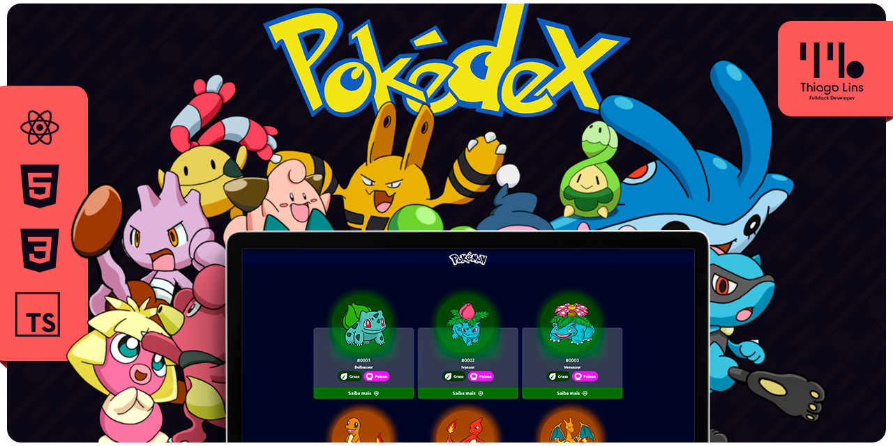

<div align="center" id="top">
 <a href="https://td-pokedex-react.vercel.app/"></a>

&#xa0;

  <a href="https://td-pokedex-react.vercel.app/">🔗 Demo ao vivo</a>
</div>

<h1 align="center">Pokédex — Next.js 16</h1>

<p align="center">
  
  
  
  
</p>

<p align="center">
  <a href="#dart-sobre">Sobre</a> &#xa0; | &#xa0;
  <a href="#sparkles-funcionalidades">Funcionalidades</a> &#xa0; | &#xa0;
  <a href="#rocket-tecnologias">Tecnologias</a> &#xa0; | &#xa0;
  <a href="#zap-arquitetura--cache">Arquitetura & Cache</a> &#xa0; | &#xa0;
  <a href="#checkered_flag-começando">Começando</a> &#xa0; | &#xa0;
  <a href="#open_file_folder-estrutura">Estrutura</a> &#xa0; | &#xa0;
  <a href="#memo-licença">Licença</a> &#xa0; | &#xa0;
  <a href="https://github.com/thiilins" target="_blank">Autor</a>
</p>

<br>

## :dart: Sobre

**Pokédex** é uma aplicação web moderna que cataloga os **1025 Pokémon** de todas as gerações, com busca, filtros por tipo, ordenação, ficha detalhada e uma **arena de combate** para comparar dois Pokémon lado a lado. Consome a [PokeAPI](https://pokeapi.co/) e é construída sobre **Next.js 16** com **Cache Components (PPR)**, priorizando velocidade percebida — a home chega pré-renderizada como conteúdo estático e os dados são cacheados de forma agressiva (a PokeAPI é imutável).

O projeto nasceu como estudo e evoluiu para uma vitrine de boas práticas de cache e renderização do App Router moderno: separação clara entre camada de dados `use cache` (server-only) e o transporte para o cliente (Server Actions / Route Handlers), com leitura em massa paralelizada para o grid.

## :sparkles: Funcionalidades

- 🔍 **Catálogo completo** — os 1025 Pokémon com busca por nome/ID, filtro por tipo e ordenação.
- 🃏 **Cards do grid** — payload leve e carregamento paralelo, com infinite scroll.
- 📄 **Ficha detalhada** (`/pokemon/[id]`) — stats, habilidades, cadeia de evolução, formas, variedades, golpes, sprites retrô e galeria de artes (shiny, female, home, dream world...).
- ⚔️ **Arena de combate (Versus)** — compara dois Pokémon lado a lado.
- 🎴 **Modal de perfil** — visão rápida com abas (Sobre / Combate / Golpes).
- 🌟 **Pokémon do dia** — destaque determinístico que muda diariamente.
- 🖼️ **Export do card em PNG** (via `html-to-image`).
- 🔊 **Cries** — reprodução do som do Pokémon.
- 📱 **Responsivo** com estética gamer premium (auras por tipo, holográfico, gradientes).

## :rocket: Tecnologias

| Camada | Tecnologia |
| ------ | ---------- |
| Framework | [Next.js 16](https://nextjs.org/) (App Router, **Cache Components / PPR**) |
| UI | [React 19](https://react.dev/), [Tailwind CSS 3](https://tailwindcss.com/) |
| Linguagem | [TypeScript](https://www.typescriptlang.org/) |
| HTTP | axios / fetch |
| Ícones | [lucide-react](https://lucide.dev/), [react-icons](https://react-icons.github.io/react-icons/) |
| Extra | [html-to-image](https://github.com/bubkoo/html-to-image) (export do card) |
| Dados | [PokeAPI](https://pokeapi.co/) |
| Deploy | [Vercel](https://vercel.com/) |

## :zap: Arquitetura & Cache

O coração do projeto é o uso correto do **`use cache`** do Next.js 16. Princípios:

- **`use cache` é server-only.** O cliente alcança o dado cacheado de duas formas: por **render** (Server Component devolve HTML pronto) ou por **transporte RPC** (Server Action / Route Handler que chama a função cacheada).
- **Boot da lista sem fetch no cliente.** O `layout.tsx` chama a função cacheada e passa a **Promise sem `await`** ao Provider, dentro de `<Suspense>`; o Provider resolve via `React.use()`. A home renderiza como **estática** e a lista já chega no HTML.
- **Grid via Route Handler `GET`, não Server Action.** Server Actions são **enfileiradas** pelo Next (carregavam "uma a uma"); um `GET /api/pokemon/[id]` dispara em **paralelo** e é cacheável por browser/CDN (`Cache-Control`).
- **Leve no grid, completo sob demanda.** Os cards usam um payload leve (`getCachedPokemonCard`, 2 requisições); o detalhe completo (`getCachedPokemonDetail`) só é buscado ao abrir a ficha/modal.
- **Imutável = cache máximo.** Toda função `use cache` usa `cacheLife('max')` + `cacheTag`.

Resultado: home **estática** e `/pokemon/[id]` em **Partial Prerender (PPR)**.

## :white_check_mark: Pré-requisitos

Você precisa do [Git](https://git-scm.com), [Node.js](https://nodejs.org/en/) (18+) e npm instalados.

## :checkered_flag: Começando

```bash
# Clone este repositório
$ git clone git@github.com:thiilins/pokedex.git

# Entre na pasta
$ cd pokedex

# Instale as dependências
$ npm install

# Inicie o ambiente de desenvolvimento
$ npm run dev

# O app inicializa em http://localhost:3000
```

### Scripts disponíveis

| Comando | Descrição |
| ------- | --------- |
| `npm run dev` | Desenvolvimento (limpa `.next` antes via `predev`) |
| `npm run build` | Build de produção (Turbopack) |
| `npm run start` | Serve o build de produção |
| `npm run lint` | Lint com `next lint` |

## :open_file_folder: Estrutura

```
src/
├── app/
│   ├── layout.tsx            # root: boot da lista (use cache) + Suspense + React.use
│   ├── page.tsx              # home: grid, busca, filtros, infinite scroll
│   ├── api/pokemon/[id]/     # Route Handler GET (card leve) · ?full=1 (detalhe completo)
│   ├── pokemon/[id]/         # ficha detalhada (Server Component + PokemonPageClient)
│   └── _components/          # componentes de rota
├── services/
│   ├── pokemonService.ts     # camada de dados (use cache, server-only)
│   └── pokemonActions.ts     # Server Actions finas (transporte p/ o cliente)
├── contexts/                 # PokedexContext (lista, filtros, cache global, arena)
├── components/               # cards, modal, header, arena versus
│   └── pokemon-detail/       # painéis da ficha (stats, abilities, evolução, moves...)
├── utils/                    # getId, generateDayNumber (Pokémon do dia)
├── constants/ · hooks/ · types/
```

## :memo: Licença

Este projeto está sob licença MIT. Veja o arquivo [LICENSE](LICENSE.md) para mais detalhes.

Feito com :heart: por <a href="https://github.com/thiilins" target="_blank">Thiago Lins</a>

&#xa0;

<a href="#top">Voltar para o topo</a>
